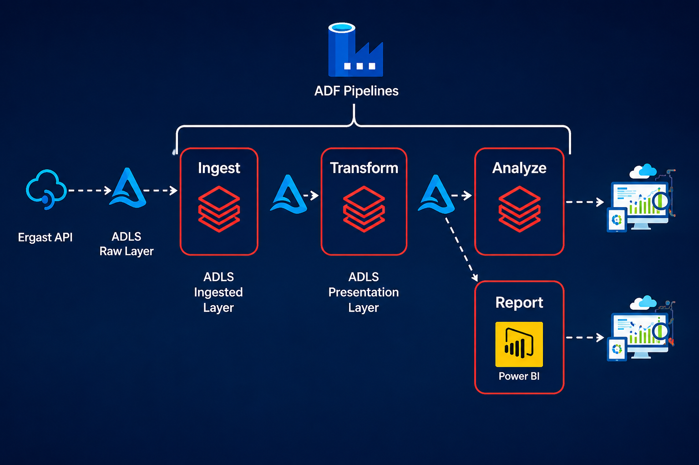
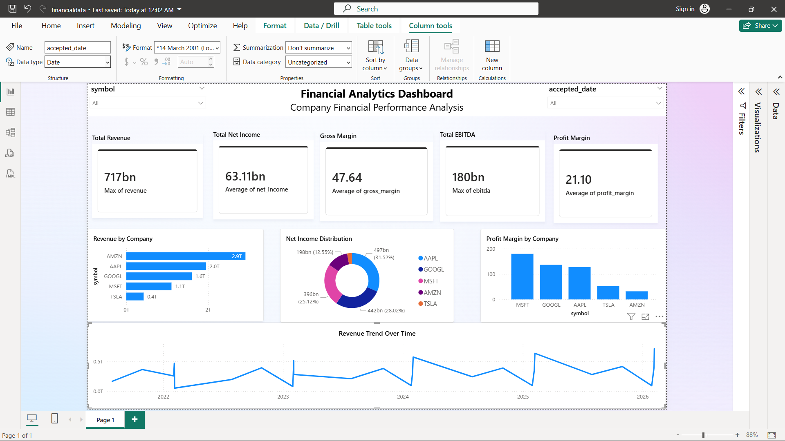

# Financial Analytics Azure Data Engineering Pipeline

## Overview

This project demonstrates an end-to-end Azure Data Engineering pipeline built using:

* Azure Data Factory (ADF)
* Azure Data Lake Storage Gen2 (ADLS Gen2)
* Azure Databricks
* Power BI
* Python & PySpark

The pipeline ingests financial company data from the Financial Modeling Prep API, processes the data through Medallion Architecture layers (Raw → Silver → Gold), and visualizes business metrics in Power BI.

---

# Architecture Diagram

## Azure Data Pipeline Flow



---

# Dashboard Preview



---

# Tech Stack

| Service                     | Purpose                           |
| --------------------------- | --------------------------------- |
| Azure Data Factory          | Pipeline orchestration            |
| Azure Databricks            | Data transformation using PySpark |
| Azure Data Lake Gen2        | Cloud storage                     |
| Power BI                    | Data visualization                |
| Python                      | Data ingestion                    |
| PySpark                     | Distributed processing            |
| Financial Modeling Prep API | Financial dataset source          |

---

# Project Architecture

```text
Financial-Analytics-Azure-Pipeline/
│
├── images/
│   ├── dashboard.png
│   └── pipeline_flow.png
│
├── notebooks/
│   ├── raw_ingestion_notebook.py
│   ├── silver_transformation_notebook.py
│   └── gold_business_metrics_notebook.py
│
├── pipeline_json/
│   ├── ARMTemplateForFactory.json
│   └── ARMTemplateParametersForFactory.json
│
├── powerbi/
│   └── financial_dashboard.pbix
│
├── .env
├── .gitignore
├── README.md
└── requirements.txt
```

---

# Medallion Architecture

## 1. Raw Layer

### Purpose

* Ingest raw API data
* Store unprocessed JSON data in ADLS

### Process

* Fetch company financial data using API
* Convert response into Spark DataFrame
* Save into ADLS Raw Layer

### Companies Used

* Apple (AAPL)
* Microsoft (MSFT)
* Tesla (TSLA)
* Amazon (AMZN)
* Google (GOOGL)

### Output Path

```python
abfss://raw@financialdatalake01.dfs.core.windows.net/financial_data/
```

---

## 2. Silver Layer

### Purpose

* Clean and standardize raw data
* Remove null values
* Create transformed business-ready datasets

### Transformations

* Selected important financial columns
* Renamed fields
* Converted data types
* Removed invalid records

### Output Path

```python
abfss://silver@financialdatalake01.dfs.core.windows.net/financial_cleaned/
```

---

## 3. Gold Layer

### Purpose

* Create analytical business metrics
* Prepare data for reporting

### Metrics Generated

* Revenue
* Net Income
* EBITDA
* Gross Margin
* Profit Margin
* Operating Margin
* EPS

### Output Path

```python
abfss://gold@financialdatalake01.dfs.core.windows.net/gold_financial_metrics/
```

---

# Azure Data Factory Pipeline

ADF orchestrates the complete workflow.

## Pipeline Activities

1. Raw ingestion notebook execution
2. Silver transformation notebook execution
3. Gold business metrics notebook execution

## Features

* Manual & scheduled triggers
* Databricks notebook integration
* Pipeline monitoring
* Automated orchestration

---

# Power BI Dashboard

## Dashboard Features

### KPI Cards

* Total Revenue
* Total Net Income
* Gross Margin
* EBITDA
* Profit Margin

### Visualizations

* Revenue by Company
* Net Income Distribution
* Profit Margin by Company
* Revenue Trend Over Time

### Filters

* Company Symbol
* Accepted Date

---

# Databricks Workflow

## Raw Notebook

### Responsibilities

* API extraction
* JSON processing
* ADLS raw storage

### Libraries Used

```python
import requests
import pandas as pd
```

---

## Silver Notebook

### Responsibilities

* Data cleaning
* Schema standardization
* Data transformation

### Libraries Used

```python
from pyspark.sql.functions import *
```

---

## Gold Notebook

### Responsibilities

* Business metric creation
* Reporting dataset preparation

---

# Pipeline Execution Steps

## Step 1

Run Raw Ingestion Notebook

## Step 2

Run Silver Transformation Notebook

## Step 3

Run Gold Business Metrics Notebook

## Step 4

Execute Azure Data Factory Pipeline

## Step 5

Refresh Power BI Dashboard

---

# Key Learnings

* Azure Data Engineering Workflow
* Medallion Architecture
* ADF Pipeline Orchestration
* Databricks Notebook Integration
* ADLS Storage Architecture
* PySpark Transformations
* Power BI Reporting
* Cloud Data Processing

---


